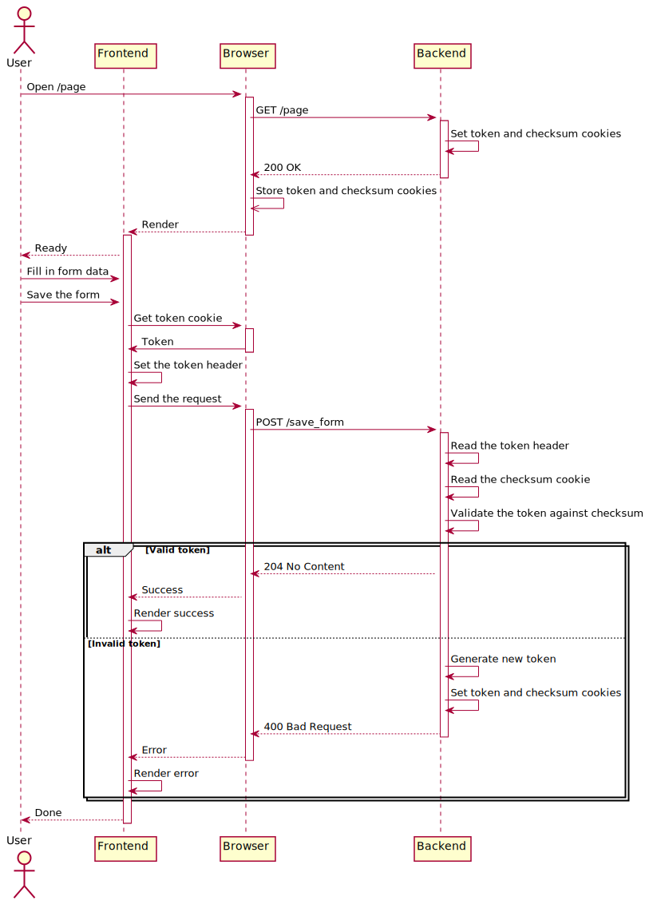
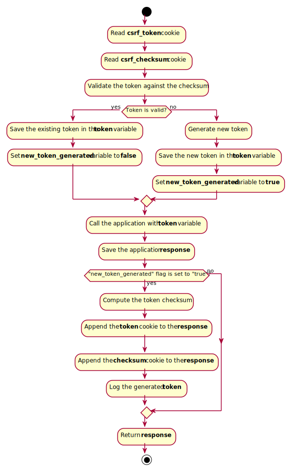
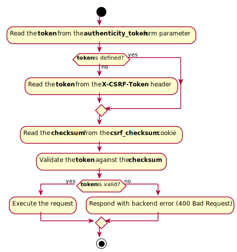
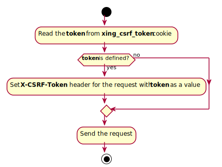
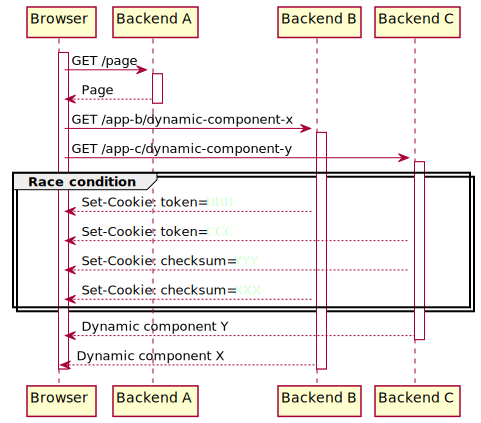
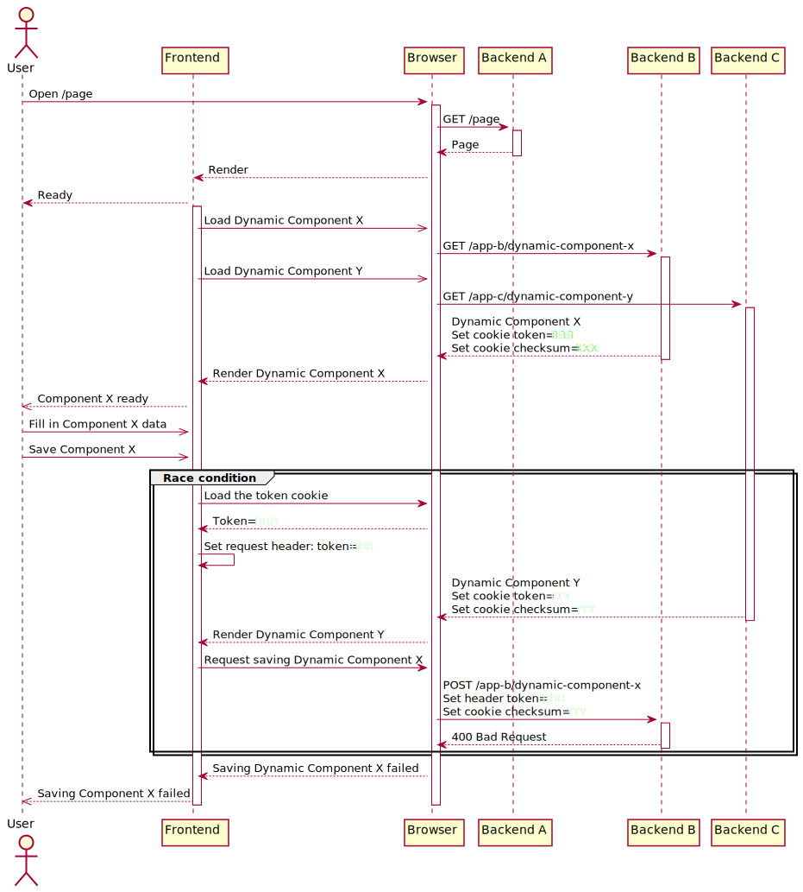

# Cross-Application CSRF Prevention

This document outlines problems discovered in Rails built-in cross-site request forgery
prevention mechanism and contains a design specification of an alternative anti-CSRF
solution that mitigates the aforementioned problems.

## Motivation

While investigating CSRF token related errors at [XING], we discovered several problems
with the CSRF prevention mechanism implemented in Rails.

The Rails CSRF prevention relies on tokens stored in application sessions, which works
well for one monolithic multiple-page application. However, it does not always work for
single-page applications since once a CSRF token is loaded as a meta tag on the page, it
is never updated until the page is reloaded (see the [unobtrusive scripting adapter] code
for details). So if the token is changed on the backend, the change will not be propagated
to the frontend until the next page reload.

The existing solution works to some extent for several multiple-page monolithic
applications sending users back and forth, each maintaining its own session and storing a
CSRF prevention token in it, but it does not work at all if one application makes an AJAX
call to another application.

We found the mentioned problems manifesting themselves as CSRF token validation errors
allover the XING platform, clearly showing that the monolithic application approach Rails
takes only partially suits the XING internal ecosystem.

We decided to design an alternative solution to address the issue.

## Requirements

An ideal anti-CSRF protection should have the following characteristics:

1. It should be secure.

1. It should allow components generated by different applications to work on the same page
(comprising a "microservice" single-page application).

1. It should not be affected by race conditions caused by the microservice nature of the
platform.

1. It should be easy to implement in any mainstream programming language in a way that
CSRF tokens generated by one application are accepted by other applications and vice
versa.

1. It should be easy to integrate the solution with legacy jQuery-based frontend
frameworks.

1. It should be easy to integrate the solution with the new generation frontend frameworks
(React for example).

1. It should automatically cure broken CSRF token state with minimal user interaction
required. Asking the user to press "Save" button one more time is acceptable; relying on
them reloading the page is not.

## Glossary

**Frontend** A part of a web application that runs in the browser. Usually implemented in
Javascript.

**Backend** A part of a web application that runs in the data center and serves the
requests  made by users and frontend over HTTP. Could be implemented in various
programming languages.

**Shared secret key** An arbitrary string known to all the backend components of the
applications. Not accessible to frontend and users.

**Token** A random string of specific length.

**Token cookie** An HTTP cookie containing a token. Readable by frontend.

**Token header** An HTTP header set by frontend while performing non-idempotent requests
to backend. Contains token as a value.

**Checksum** An HMAC hash of a token generated using shared secret key.

**Checksum cookie** An HTTP cookie containing a checksum generated on backend with some
special flags making it not accessible to frontend.

## High-Level Overview

Down below is a sequence diagram of a user loading a page and submitting an AJAX form on
it. The purpose of the diagram is to provide an overview of the solution design, while the
low-level details like the token generation, cookie names and many other are described
later.

The diagram follows the general happy path with only the important branching reflected,
which is when the CSRF token submitted by the user is invalid.



The grand idea is to use the browser cookies as the token storage. There are two cookies
set by the backend, one readable by the frontend which allows it to prove its
authenticity, and the other one, which the frontend cannot access, to make sure the token
was really generated on the backend.

To prove the authenticity of a request, frontend copies the token from the cookie to an
HTTP header of every non-idempotent request it sends to the backend. The backend receives
the token header and the checksum cookie it set earlier. It validates the token against
the checksum and terminates the execution if validation fails. An alternative way to
transport the token is to have it rendered as a hidden input in the form, allowing basic
HTML forms use the proposed protection mechanism as well.

## Top-Level Implementation Blocks

### Backend Middleware

Most modern web frameworks have the concept of middleware – a component that sits between
the application code and the web server, processing inbound requests and outbound
responses.

The backend middleware component serves several purposes:

1. Provide every browser talking to the application with a valid pair of token and
checksum cookies.

1. Regenerate the token and checksum cookies if they are for some reason invalid.

1. Supply the backend controller component with a valid token to use for outputting plain
HTML forms.



Please note that the middleware should not do anything to verify the request authenticity.
It should only make sure the browser always has a valid pair of token and checksum
cookies. It should also make sure the backend application has a valid token to output
along with HTML forms if needed.

It is important to make sure the middleware gets triggered regardless of the application's
response. The cookies must be sent even when the application generates an error and user
gets "Internal server error" page.

### Application Action Filter

The application-level code is the part that validates the request authenticity. It should
be used as a filter for non-idempotent actions, throwing an error if the request
authenticity could not be verified or letting the application code to work on the request
otherwise.



Reading the token from the **authenticity_token** parameter could be omitted if the
application does not accept requests encoded with "application/x-www-form-urlencoded" or
"multipart/form-data". For example, if the only way to POST data to the application is to
provide the data as the body of a POST requests, supporting the **authenticity_token**
form parameter does not make sense. The **X-CSRF-Token** header should always be
supported.

### Request Pre-filter

To make the backend accept a request, frontend must attach a token to the data it sends.

While this could be achieved using hidden inputs for static HTML forms, dynamic requests
issued by frontend need some special treatment. This frontend component should run as a
filter to modify outbound requests before they are sent to the backend.



Frontend must read the token cookie for **each and every** request it sends to make sure
it picks up the up-to-date value issued by the backend. It is not acceptable to store the
token in a variable or cache it in any other way for reuse to make sure self-healing works
as designed.

## Low-level Implementation Details

This section describes specific details of token generation, verification and transfer, as
well as logging and request preparation logic.

### Token Generation

A token must be a random byte sequence at least 16 bytes long encoded with unpadded
[Base 64 with URL and filename safe alphabet]. The application must use a secure random
number generator provided by the language/platform, similar to Ruby's [SecureRandom].

While a token of any length greater than 16 bytes will suffice, to make the solution Rails
friendly it is necessary to use exactly 24 bytes of random data so the encoded
representation is exactly 32 characters.

Token generation example (Ruby):

```ruby

require 'securerandom'
require 'base64'

token_length = 24
random_bytes = SecureRandom.random_bytes(token_length)
token = Base64.urlsafe_encode64(random_bytes, padding: false)
```

### Checksum Generation

As a prerequisite, the application needs access to the shared secret key. The key could be
delivered to the application via an environment variable (in production environment) or
with app-specific configuration file.

To generate a checksum of the token the application needs to calculate an HMAC SHA256
digest of the token using the shared secret key and encode it with unpadded
[Base 64 with URL and filename safe alphabet].

Checksum generation example (Ruby):

```ruby
require 'openssl'
require 'base64'

token = generate_token # implemented somewhere else, returns a base64-encoded string
shared_secret_key = ENV['SHARED_CSRF_PREVENTION_KEY'] # using an environment variable

digest_algorithm = OpenSSL::Digest::SHA256.new
token_digest = OpenSSL::HMAC.digest(digest_algorithm, shared_secret_key, token)
checksum = Base64.urlsafe_encode64(token_digest, padding: false)
```

To validate a checksum generator implementation, one should compute a checksum of a token
`such protect` using a shared secret key `much secure`. The result should be exactly equal
to `fEFyEXot47K5knjFe7MB-CKW4q99a7BmP9rKwrxf9Qk`.

```ruby
token = 'such protect'
secret_key = 'much secure'

checksum = generate_checksum(token, secret_key) # your implementation
checksum == 'fEFyEXot47K5knjFe7MB-CKW4q99a7BmP9rKwrxf9Qk' # true
```

### Generating, Delivering and Using Shared Secret Key

To fully leverage the security of SHA256, shared secret key must contain 32 bytes of
random data. In order to deliver the key through an environment variable which is a
non_binary channel, it is necessary to convert the binary data to the text form unaffected
by any encoding/decoding happening while the key is being delivered to the HMAC
computation code (that includes shell escaping, Unicode-related string conversions and so
on). The simplest way to deal with this is to generate a 32 bytes long random sequence and
encode it as a hexadecimal string, which then is used as an HMAC digest key without any
additional decoding. Example of the shared secret key generation (Ruby).

```ruby
require 'securerandom'

shared_secret_key = SecureRandom.hex(32)
```

The above snippet generates a string similar to this:
`9ce7da51dab29204295c23cf6d9d49e72857a2010c382becc1f43213c0757977`, which can be used as a
shared secret key directly.

The shared secret key must be generated separately for every distinct environment
(production, staging, development and so on).

It is preferred to deliver the key to applications via an environment variable to avoid
hard-coding it in many separate configuration files.

### Validating a Token Against Checksum

To validate a token the application must generate a checksum of the token in a regular way
and compare the result to the checksum received along with the request.

If the calculated checksum is equal to the request checksum, the token is valid, otherwise
it is not.

The implementation must use a constant time string comparison algorithm similar to the one
implemented in [ActiveSupport SecurityUtils] to avoid opening a window for timing attacks.

### Using Unpadded Base 64 with Url and Filename Safe Alphabet

URL-safe Base 64 should be used for encoding tokens and checksums to avoid conversion
error that could happen when URL-unsafe characters are present in the encoded data.

Some backend frameworks encode cookies with URI fragment encoding which then would
potentially require decoding on the frontend or the backend side. To avoid such problems,
the application must use unpadded Base 64 encoding with URL and Filename safe alphabet
(see [RFC 4648 §5]). It is necessary to strip all the trailing padding characters from the
result of the encoding in order to obtain the unpadded result.

### Setting the Token and the Checksum Cookies on Backend

The application must set two cookies, one containing the token and another one containing
the checksum.

Both cookies should have no expiration time set, which essentially makes them session
cookies.

Token cookie name: **csrf_token**

Flags for the token cookie:
* path: /
* secure: true if running in SSL environment, false otherwise
* sameSite: strict

Checksum cookie name: **csrf_checksum**

Flags for the checksum cookie:
* path: /
* httpOnly: true
* secure: true if running in SSL environment, false otherwise
* sameSite: strict

The application must set both cookies at the same time for any particular request. It is
not acceptable to set only one of them for whatever the reason could be.

### Setting the Token for Plain Html Forms

To protect the requests made with plain HTML forms it is necessary for the application to
transfer the token along with the form data. To accomplish that the application must
generate a hidden input named **authenticity_token** with the value set to current token.

### Setting the Token Header on Frontend

The frontend must set the token header for every non-idempotent request to the backend it
issues.

To obtain the token the frontend must read the **csrf_token** cookie. If the cookie does
not exist, the frontend must not set the token header. Otherwise, it must set a header
with the name **X-CSRF-Token** and the value read from the token cookie.

The frontend must not check or alter the token value, it should just copy it to the header
with no additional processing.

Please refer to the following jQuery snippet:

```javascript
$.ajaxPrefilter(function(options) {
    var token = (document.cookie.match(/(?:^|;\s*)csrf_token=([^;]+)/) || [])[1];

    if (token) {
      options.headers["X-CSRF-Token"] = token;
    }
});
```

### Backend: Token Logging

In order to make debugging the CSRF token validation problems easier it is necessary for
the backend to log generated tokens. The logging should happen only when there is a new
token generated and sent to the browser (via Set-Cookie header).

Since a particular token could be generated by any application, all of them should log
generated tokens in the same format so it is easy to navigate the logs. The log message
should look like this: `Set CSRF token: #{token}`

Logging example (Ruby on Rails):

```ruby
Rails.logger.info("Set CSRF token: #{token}")
```

## Security Highlights

Transferring the token from backend to frontend in a cookie is secure because a cookie
could only be read by the code running on the same domain it was generated at.

Outputting the token as a hidden field in an HTML form is secure because page contents is
a subject to browser's same origin policy which prevents third-party scripts from reading
the content and discovering the token.

The checksum token is flagged as HTTP only which makes it inaccessible for the frontend at
all.

Using HMAC-SHA256 with a secret key to generate the checksum guarantees that it is
impossible to forge a checksum on the frontend.


## Avoiding Permanently Broken Tokens

Validating the token and the checksum cookies on every request (and regenerating if
invalid) makes it almost impossible for the application to be permanently locked with an
invalid CSRF token. Even if some request to the backend has an invalid token or checksum
attached to it, the error response will contain a valid token and checksum pair which,
combined with the requirement of always using the recent token from the browser cookies,
will guarantee the next request will succeed.

The worst thing to happen from the user's perspective is to get an error message and click
the "Save" button one more time. Reloading the page is not required.

## Race Condition Handling

There are at least two foreseeable race condition scenarios possible with the proposed
solution.

### Scenario 1: Simultaneous Token Generation

Imagine there is an application page which does not have the CSRF prevention turned on (so
the token is not set) but it uses two dynamic components which require the anti-CSRF
protection.

There is no specification on how browsers should process the responses arriving
simultaneously, so two components being loaded in parallel theoretically open a
possibility for a race condition to happen when the browser interprets the Set-Cookie
headers.



On the diagram, responses of Backend B and Backend C get intertwined. Every backend
responds with a valid token + checksum pair (BBB + XXX for Backend B and CCC + YYY for
Backend C), but after the browser saves the cookies into the storage, the state is CCC +
XXX, which is invalid.

Since the presence of the race condition depends on the browser implementation, a proof of
concept application was developed. The result is negative: browsers evaluate the headers
when they are received completely. That means the time window for the race condition to
happen is narrowed down to the browser's internal cookie storage access time, which makes
it almost impossible to happen.

### Scenario 2: Belated Response

The users opens a page which does not generate the token itself but loads two components
that require anti-CSRF protection. One of the components is loaded quickly, the user
interacts with it and commands it to send some data to the backend. The belated response
containing the second component (and another token + checksum cookie pair) arrives exactly
before the request to save the first component's data is sent.



The Backend C is for some reason slow which results in its response arriving exactly after
the frontend read the token cookie to set the token header but before the request to
Backend B was sent. The browser sends cookies automatically, so Backend B gets the recent
checksum from the cookie but an outdated token from the header which was set on the
request a bit earlier. The result is an invalid token + checksum pair of BBB + YYY sent to
Backend B.

While this situation can happen, the probability of such race condition is low because of
the narrow time window. The belated request must arrive exactly between reading the token
and sending the request, and since the token should be read from the cookies right before
sending the request, it is unlikely to happen.

In order to fully mitigate this race condition, the application should generate the token
+ checksum pair in advance for every page containing several dynamic components that
demand anti-CSRF protection.

[XING]: https://www.xing.com
[unobtrusive scripting adapter]: https://github.com/rails/rails/tree/master/actionview/app/assets/javascripts
[Base 64 with URL and filename safe alphabet]: https://tools.ietf.org/html/rfc4648#section-5
[SecureRandom]: http://ruby-doc.org/stdlib-2.4.1/libdoc/securerandom/rdoc/SecureRandom.html
[ActiveSupport SecurityUtils]: http://api.rubyonrails.org/classes/ActiveSupport/SecurityUtils.html#method-c-secure_compare
[RFC 4648 §5]: https://tools.ietf.org/html/rfc4648#section-5
